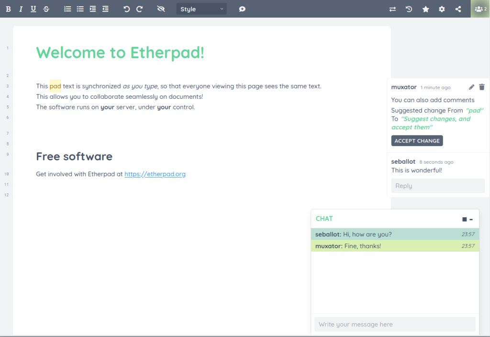

<!--
Este archivo README esta generado automaticamente<https://github.com/YunoHost/apps/tree/master/tools/readme_generator>
No se debe editar a mano.
-->

# Etherpad para Yunohost

[](https://ci-apps.yunohost.org/ci/apps/etherpad/)  

[](https://install-app.yunohost.org/?app=etherpad)

*[Leer este README en otros idiomas.](./ALL_README.md)*

> *Este paquete le permite instalarEtherpad rapidamente y simplement en un servidor YunoHost.*  
> *Si no tiene YunoHost, visita [the guide](https://yunohost.org/install) para aprender como instalarla.*

## Descripción general

Etherpad is a real-time collaborative editor scalable to thousands of simultaneous real time users. It provides full data export capabilities, and runs on your server, under your control.
This version of Etherpad is installed without plugins and uses Redis as database.
Be aware, Redis database backup and restore is not fully implemented.
If you want to install Etherpad with plugins and mysql database: https://github.com/YunoHost-Apps/etherpad_mypads_ynh",


**Versión actual:** 2.2.2~ynh1

**Demo:** <https://video.etherpad.com/>

## Capturas



## Documentaciones y recursos

- Sitio web oficial: <https://etherpad.org/>
- Documentación administrador oficial: <https://etherpad.org/doc/v2.0.2/>
- Repositorio del código fuente oficial de la aplicación : <https://github.com/ether/etherpad-lite>
- Catálogo YunoHost: <https://apps.yunohost.org/app/etherpad>
- Reportar un error: <https://github.com/YunoHost-Apps/etherpad_ynh/issues>

## Información para desarrolladores

Por favor enviar sus correcciones a la [`branch testing`](https://github.com/YunoHost-Apps/etherpad_ynh/tree/testing

Para probar la rama `testing`, sigue asÍ:

```bash
sudo yunohost app install https://github.com/YunoHost-Apps/etherpad_ynh/tree/testing --debug
o
sudo yunohost app upgrade etherpad -u https://github.com/YunoHost-Apps/etherpad_ynh/tree/testing --debug
```

**Mas informaciones sobre el empaquetado de aplicaciones:** <https://yunohost.org/packaging_apps>
